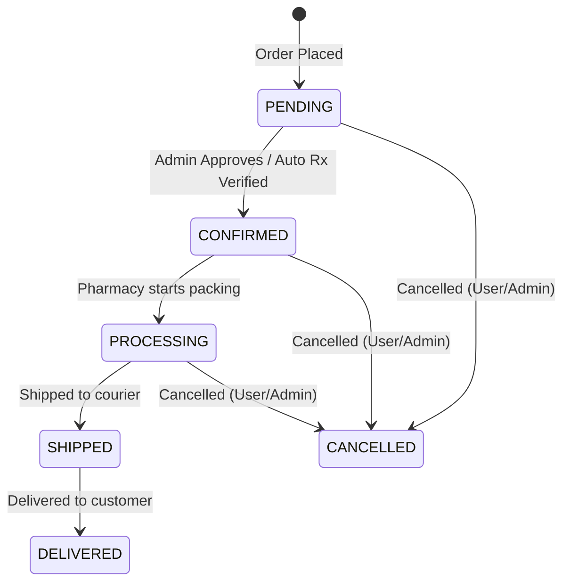

# Order Management Workflow

Hey dev! This document maps out the lifecycle of an order in My Pharma, detailing the state machine, business rules, and how database statuses translate to user and admin actions.

---

## Order Status State Machine

Our backend database uses specific text choices defined in `Order.Status`. Here is how they transition:



| DB Status (`Order.Status`) | Display Name | Trigger / Business Meaning |
| :--- | :--- | :--- |
| `PENDING` | Pending | Order is placed but not yet verified (e.g., Rx verification or payment validation pending). |
| `CONFIRMED` | Confirmed | Order is validated (prescriptions approved if any, stock confirmed). Default status for approved prescription orders. |
| `PROCESSING` | Processing | Pharmacy staff is packing the order. |
| `SHIPPED` | Shipped | Order has been handed over to the delivery rider/courier. |
| `DELIVERED` | Delivered | Order is successfully received by the customer. Triggers auto-settlement creation. |
| `CANCELLED` | Cancelled | Order is cancelled. Can only occur *before* the order transitions to `SHIPPED`. |

---

## Actions by Status

Here is what is permitted at each stage of the lifecycle:

### `PENDING` (Pending)
* **User Actions:** Can cancel the order (`can_cancel_order()`), track order.
* **Admin Actions:** Verify prescriptions (if Rx check required), cancel order.
* **System Actions:** Send confirmation notifications (FCM, SMS).

### `CONFIRMED` (Confirmed)
* **User Actions:** Can cancel the order, track order.
* **Admin Actions:** Transition to `PROCESSING` (Pack order), cancel order.
* **System Actions:** Generate invoice email.

### `PROCESSING` (Processing)
* **User Actions:** Track order. Can cancel the order if packing is not completed.
* **Admin Actions:** Transition to `SHIPPED`, cancel order.
* **System Actions:** Generate invoice PDF.

### `SHIPPED` (Shipped)
* **User Actions:** Track order. **Cancellation is NOT allowed** once shipped.
* **Admin Actions:** Mark as `DELIVERED`.
* **System Actions:** Send tracking updates to user.

### `DELIVERED` (Delivered)
* **User Actions:** Rate products, request a return (allowed within `RETURN_ALLOWED_DAYS = 7` days for unopened items).
* **Admin Actions:** Process returns/refunds.
* **System Actions:** Auto-generate `OrderSettlement` record for the pharmacy payout ledger.

---

## Cancellation Business Rules

A user or admin can cancel an order only if it has not yet been shipped. The helper property `can_cancel_order` enforces this:
```python
# Returns True if order status is PENDING, CONFIRMED, or PROCESSING.
# Returns False if status is SHIPPED, DELIVERED, or CANCELLED.
```
When an order is cancelled, the inventory deducted during order placement is automatically restored back to `Product.quantity_in_stock`.
