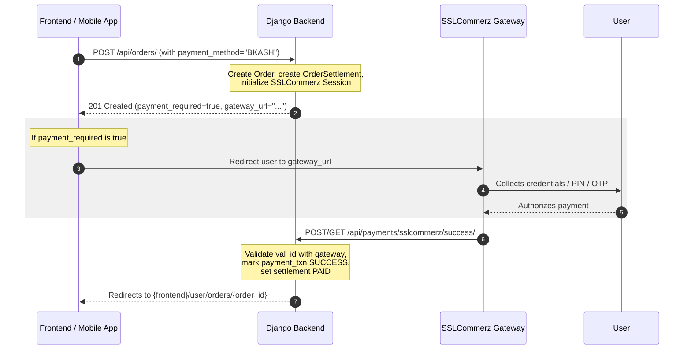

# Payment Processing & SSLCommerz Integration

Hey dev! This guide covers how our payment integration works under the hood, how the APIs behave, and how to implement the payment redirection flows in the frontend or mobile app.

---

## Supported Payment Methods (Bangladesh MVP)

We support Cash on Delivery (COD) and multiple digital wallets via **SSLCommerz**:

| Method Code | Gateway Option | Description | Transaction Fee |
| :--- | :--- | :--- | :--- |
| `COD` | N/A | Cash on Delivery (default) | 0% |
| `ONLINE` | SSLCommerz Gateway | Generic online checkout | 1.5% |
| `BKASH` | bKash wallet | Mobile banking checkout | 1.5% |
| `NAGAD` | Nagad wallet | Mobile banking checkout | 1.5% |
| `ROCKET` | Rocket wallet | Mobile banking checkout | 1.5% |
| `UPAY` | Upay wallet | Mobile banking checkout | 1.5% |
| `CARD` | Card payments | Visa, Mastercard, AMEX | 1.5% |

---

## The Payment Redirection Flow



### 1. Initiating the Payment
When placing an order via:
* **Standard Checkout**: `POST /api/orders/`
* **Cart Checkout**: `POST /api/cart/place-order/`
* **Direct Buy**: `POST /api/orders/buy-now/`

Pass the `payment_method` in the request body. If the method is an online method (e.g., `BKASH`), the API response will include payment metadata:
```json
{
  "id": 42,
  "status": "PENDING",
  "total": "300.00",
  "payment_required": true,
  "payment_method": "BKASH",
  "payment_provider": "SSLCOMMERZ",
  "gateway_url": "https://sandbox.sslcommerz.com/gwprocess/v4/api.php?gkey=...",
  "tran_id": "PAY-16-16A5BC65B20..."
}
```
**Frontend Action:** If `payment_required` is `true`, redirect the user immediately to `gateway_url`.

### 2. Callback Handling & Redirection
Once the user completes or cancels the transaction, SSLCommerz calls our backend callbacks. The backend validates the payment status, marks the settlement, and redirects the user back to the frontend:
* **Success View** (`/api/payments/sslcommerz/success/`):
  * Validates the transaction with SSLCommerz using the `val_id`.
  * Verifies that the currency and total matches.
  * Updates `PaymentTransaction` to `SUCCESS` and `OrderSettlement` payment status to `PAID`.
  * Redirects to: `{frontend_base_url}/user/orders/{order_id}`
* **Fail View** (`/api/payments/sslcommerz/fail/`):
  * Marks the transaction `FAILED`.
  * Redirects to: `{frontend_base_url}/checkout?payment_status=failed&order_id={order_id}`
* **Cancel View** (`/api/payments/sslcommerz/cancel/`):
  * Marks the transaction `CANCELLED`.
  * Redirects to: `{frontend_base_url}/checkout?payment_status=cancelled&order_id={order_id}`
* **IPN View** (`/api/payments/sslcommerz/ipn/`):
  * Handles asynchronous Instant Payment Notifications to verify the transaction in the background, in case the user closes the browser before redirection.

---

## Prescription Orders Payment Flow

Prescription-based orders approved by administrators are created automatically via `_create_order_from_prescription`. 

1. When approved, a default `OrderSettlement` record is created with `payment_method = COD` and `payment_status = PENDING`.
2. To pay online for this order, the user can call:
   * **Endpoint:** `POST /api/orders/{id}/pay/`
   * **Body:** `{"payment_method": "BKASH"}` (or any other online method)
3. The response will return the `gateway_url` and `tran_id` to redirect the user, and update the settlement method to `ONLINE`.

---

## Database Schema Highlights

We use two primary tables to track payments:
1. `core_order_settlement` (`OrderSettlement`):
   * One-to-one relationship with `Order`.
   * Tracks overall `payment_method` (`COD` / `ONLINE`) and `payment_status` (`PENDING` / `PAID`).
   * Manages commissions, cash collections, and payouts.
2. `core_payment_transaction` (`PaymentTransaction`):
   * Tracks individual payment attempts/sessions initialized with SSLCommerz.
   * Stores `tran_id`, `session_key`, `gateway_url`, `status` (`INITIATED`, `SUCCESS`, `FAILED`, `CANCELLED`), and verification payloads.
